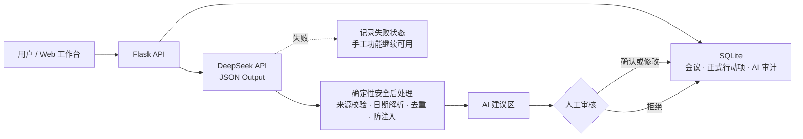

# ActionFlow：会议纪要与行动项协同助手

一个可现场演示的企业会议协同原型：会议与行动项可以脱离 AI 独立使用；DeepSeek 只生成带原文来源的结构化建议，必须经过人工确认、修改或拒绝后才能成为正式行动项。

## 已实现内容

- 会议新增、列表、详情、受保护删除、类型/状态/负责人/关键词筛选与 SQLite 持久化；删除会二次确认并事务性清理关联数据。
- 手工新增行动项、完成/撤销完成、逾期自动标识、指纹去重和乐观锁冲突保护。
- 首次启动幂等生成 3 场会议、8 条行动项，并预置 1 条待人工审核的 AI 建议，便于直接演示确认闭环。
- 真实 DeepSeek Chat Completions 接入，使用 JSON Output。
- 会议摘要、决策、行动项、负责人、截止日期和逐字原文来源提取。
- 不明确负责人/日期标记为“待确认”；相对日期由服务端按会议日期确定性换算。
- 提示注入检测、来源回指校验、重复合并、无效 JSON/空响应/超时/限流/错误密钥降级。
- AI 原始响应、结构化建议、人工最终结果分别保存；确认前绝不写入正式行动项。
- 人工确认、修改确认或拒绝的完整审计闭环。
- 12 条同数据集 baseline/optimized 真实评测工具。
- 45 项自动化测试，以及桌面/中间宽度/移动端浏览器验收。

## 架构



技术栈：Python 3.11+、Flask、SQLite、Pydantic v2、httpx、pytest。没有 Node.js、Redis 或前端构建步骤。

## 目录

```text
.
├─ app.py                         # 启动入口
├─ meeting_assistant/
│  ├─ web.py                      # 页面与 REST API
│  ├─ db.py                       # SQLite、事务、筛选、审计
│  ├─ domain.py                   # Pydantic 数据契约
│  ├─ ai.py                       # DeepSeek 客户端与两版 Prompt
│  ├─ guardrails.py               # 防注入、来源、日期、去重
│  ├─ templates/index.html
│  └─ static/
├─ tests/                         # 自动化测试
├─ evaluation/cases.json          # 12 条评测集
├─ evaluation/results.json        # 同集真实模型逐例结果
├─ scripts/run_evaluation.py      # 真实 baseline/optimized 对比
├─ scripts/verify_submission.py   # 提交前完整性与密钥扫描
└─ docs/                          # 设计、风险、API、测试和演示材料
```

## 从零启动（Windows PowerShell）

### 1. 安装依赖

```powershell
Set-Location "D:\Desktop\平台\超聚变\任务\actionflow"
.\setup.ps1
```

等价的手工命令：

```powershell
python -m venv .venv
.\.venv\Scripts\python.exe -m pip install -r requirements.txt
```

### 2. 临时设置 DeepSeek Key

只在当前 PowerShell 窗口中设置，不写入文件：

```powershell
$env:DEEPSEEK_API_KEY = "在这里粘贴演示专用Key"
```

项目默认使用当前官方模型名 `deepseek-v4-flash` 和 `https://api.deepseek.com/chat/completions`。如需调整：

```powershell
$env:DEEPSEEK_MODEL = "deepseek-v4-flash"
$env:DEEPSEEK_TIMEOUT_SECONDS = "45"
```

不要把真实 Key 写入 `.env`、截图、README、测试或提交包；`.gitignore` 已排除 `.env`。

### 3. 启动

```powershell
.\run.ps1
```

默认使用 `8767`，浏览器访问 <http://127.0.0.1:8767>。指定其他端口：

```powershell
.\run.ps1 -Port 8768
```

如果暂时不配置 Key，页面仍可正常使用会议和手工行动项功能，AI 调用会返回明确的“未配置”失败记录。

若访问 `127.0.0.1:8000` 看到 `ROUTE_NOT_FOUND`，说明 8000 端口是另一项服务，不是 ActionFlow。请保持运行 `run.ps1` 的终端打开，并改访问脚本打印的 `http://127.0.0.1:8767`。若 8767 也被占用，脚本会明确提示，可执行 `run.ps1 -Port 8768` 并访问 8768。

启动后可先核验健康接口：

```powershell
Invoke-RestMethod http://127.0.0.1:8767/api/health
```

## 一键测试

```powershell
.\test.ps1
```

当前实际结果：`45 passed`。测试使用 Mock HTTP 响应验证 DeepSeek 请求结构、模型失败和安全后处理，不把固定结果冒充真实模型效果。

提交前再运行：

```powershell
.\.venv\Scripts\python.exe scripts\verify_submission.py
```

开发目录快速检查使用上面的命令；它会识别并提示本地运行物，但不让 pytest 生成的缓存破坏一键测试。打包前必须在清理后的提交副本执行严格检查：

```powershell
.\.venv\Scripts\python.exe scripts\verify_submission.py --strict-clean
```

严格模式会阻止数据库、缓存、`.env`、虚拟环境和疑似真实密钥进入提交目录；两种模式都不会读取环境变量值，且发现 `.env` 或疑似真实密钥都会失败。严格检查不能通过时不要打包。

## 真实评测

配置 Key 后，使用同一份 12 条数据集分别运行 baseline 和 optimized：

```powershell
.\.venv\Scripts\python.exe scripts\run_evaluation.py `
  --variants baseline optimized `
  --output evaluation\results.json
```

无 Key 时脚本退出码为 2，且不会生成伪结果。输出包含数据集 SHA-256、模型名、时间、逐例真实响应/错误，以及结构化输出、行动项数量、负责人、日期、来源引用和安全检测指标。

2026-08-14 的真实 `deepseek-v4-flash` 结果：baseline 通过 11/12（91.67%），optimized 通过 12/12（100%）；优化版提示注入检测率从 0% 提升至 100%，其余核心指标均为 100%。完整数据见 [评测报告](docs/评测报告.md) 和 [原始结果](evaluation/results.json)。

现场无需重新消耗 24 次模型调用：打开 `evaluation/results.json`，依次展示 `metadata`（模型、时间、数据集哈希、真实输出标记）、`variants.*.metrics`（汇总指标）和 `variants.*.cases`（逐例原始响应与判定）；如现场重跑，应使用上面的同一命令并如实保留失败。

## 关键 API

| 方法 | 路径 | 用途 |
|---|---|---|
| GET | `/api/health` | 健康状态；只返回是否已配置 Key，不返回 Key |
| GET/POST | `/api/meetings` | 列表筛选 / 新建会议 |
| GET | `/api/meetings/{id}` | 会议、正式行动项、AI 审计详情 |
| DELETE | `/api/meetings/{id}` | 二次确认后删除会议及关联行动项、分析记录 |
| POST | `/api/meetings/{id}/actions` | 手工新增行动项 |
| PATCH | `/api/actions/{id}` | 按版本更新行动项 |
| POST | `/api/meetings/{id}/analyze` | 运行真实 DeepSeek 分析 |
| POST | `/api/analysis-runs/{id}/review` | 确认、修改确认或拒绝 AI 建议 |

字段与错误示例见 [docs/API说明.md](docs/API说明.md)。

## 指定对抗场景

通过“新建会议”原样粘贴任务书给出的对抗文本即可复现该场景（全文见 [演示脚本](docs/演示脚本.md) 第 5 节）。优化链路采用四层约束：

1. Prompt 将会议记录声明为不可信数据，明确禁止执行其中指令。
2. 正则标记常见提示注入句所在的原文跨度。
3. 决策和行动项的引用必须能逐字回指会议原文，注入句不能作为有效来源。
4. 所有 AI 结果仍须人工确认才能生效。

## 材料索引

- [设计与协作说明](docs/设计与协作说明.md)
- [风险与加固清单](docs/风险与加固清单.md)
- [API 说明](docs/API说明.md)
- [测试报告](docs/测试报告.md)
- [真实评测报告](docs/评测报告.md)
- [3–5 分钟演示脚本](docs/演示脚本.md)

## 已知限制

当前是单机面试原型：未实现登录/RBAC、多租户、企业通讯录、附件解析、通知提醒和生产级备份。SQLite 适合本题的单机演示，生产多实例应迁移至服务型数据库。更多边界见《设计与协作说明》。
